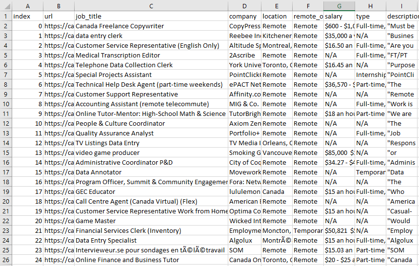

# Description
Python script(s) to showcase web-scraping skills using BeautifulSoup4 for parsing and Pandas for saving results.

# Installation
- cd to project root.
- download the requirements by typing 'pip install -r requirements.txt', if you don't want to install to local machine I recommend creating a python virtual environment.
- call the script using following command 'python indeed_scraper.py'.

# Results from Indeed Scraper
Scraping 25 entries from Indeed for remote jobs in Canada:

  

